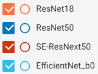
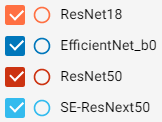

# Image Classification - Cifar100
***
### 目的:
##### Cifar10/Cifar100 是經典的分類型圖片資料集，32x32 的小圖片雖然運算極快，但是圖片過小造成特徵萃取不易而導致模型訓練不佳，這篇就以這個經典圖片集當作圖片分類運算分析的大魔王來挑戰一下看看不同模型 backbone 的學習效果。
***
### 資料集 ( DataSet )
* 名稱: Cifar100
* 圖片尺寸: 32 x 32
* 物件種類數量: 100
* 物件: 海豚, 鬱金香, 橘子, 沙發, 蝴蝶, 城堡, 森林, 大象, 女孩, 火車…等等
* 圖片數量: 50000(train) / 10000(test)
* 來源: https://www.cs.toronto.edu/~kriz/cifar.html

***
### 模型 ( Model Backbones )
* EfficientNet_b0
* ResNet18
* ResNet50
* SE-Resnext50
##### 基於運算資源有限，所以這邊僅以 ResNet 相關模型為主，並輔以一個差不多等級的 EfficientNet_b0 來比較結果。Backbone 後面直接串接一個輸出為100的線性模組當作分類器，輸出結果再加上softmax()使其100個預測值呈現0~100%之間的機率分布(總合為100%)。  
##### 由於圖片尺寸僅僅只有 32x32，跑完model stride=32 的特徵萃取就只剩1個值的輸出，對於後續的分類器實難達成好的結果，所以此篇還會再往上內插到更大的圖片來看看模型的效果。
***
### 資料增強 ( Data Augmentation )
##### 為增強資料集的廣泛性與避免訓練 過擬化( over-fit )，訓練上都有隨機加上包括 Transpose, HorizontalFlip, VerticalFlip, ShiftScaleRotate, CoarseDropout, HueSaturationValue 等等變化及正規化 (Normalize)。
***
### 從零開始訓練 ( Train, From-Scratch)
##### 這種很難訓練的圖片資料集，最好是載入 預訓練(pretrained)模型參數做遷移式訓練(transfer learning)是最佳方式，但是為了顯示差異，這篇特別試試從零開始(From-Scratch)來作為比對看看效果。  
##### 當然，從零開始訓練需要更長的學習次數，通常都可能需要數百epochs才足夠，但是cifar100圖片過小，非常快就會過擬合(over-fit)，所以此處就以 50 epochs 當作實驗次數，學習率(learning rate)變化採用 cosine 下降。
### Learning Rate
  
***
### Image size: 32x32
  

***
### Image size: 64x64
  

***
### Image size: 128x128
  

***
##### 從以上結果來看，圖片尺寸 32x32 的確遠遠不夠撐起模型的訓練，不過這邊僅僅使用內插來增加圖片尺寸還是會限縮精確度，如果有原始大圖片可以使用應該可以達到更佳效果。  
##### 另外，train/valid loss 結果可以很明顯的發現 過擬合 (overfit) 的問題，可以看的出來 train loss 還在持續下降，但是 valid loss 卻開始往上翹，這也是典型的背答案的訓練問題。雖然已經使用了資料增強(data augmentation)，但應該是圖片過小資訊量過低造成模型訓練上容易偷偷背起了訓練圖片特徵而失去了一般性與廣泛性。尤其是 ResNet50 情況特別嚴重，看起來是大模型對付小圖片有點殺雞用牛刀造成過度學習了。
***
### 遷移式訓練 ( Train, transfer learning)
##### 上面的從零開始訓練看起來實在是慘烈，尤其是過擬合問題相當明顯。這邊就一樣試試從巨人肩膀出發看看預載參數的結果會是如何。  
##### 相對於從零開始訓練，遷移式所需的學習次數不用太多，故以 epochs=10 作為微調(fine-tune) 次數，學習率同樣採用 cosine 下降。
### Learning Rate

***
### Image size: 32x32
  

***
### Image size: 64x64
  

***
### Image size: 128x128
  

##### 相較起來，遷移式學習的效果好了不少，尤其準確度更是提高了相當的多，整體學習曲線也相對穩定，當然學習次數少也間接去掉了過擬合的問題。
***
### 測試 ( Test )
  
##### 從測試圖片集(test dataset)來看最終結果，當然是遷移式學習遠勝從零開始的學習，不愧是由更大型的圖片集 (ImageNet) 千錘百鍊學習而來的模型參數，載入後稍加微調都能遠勝從零開始的訓練。最佳的 SE-ResNext50 可以達到約 81% 的結果，和論文中的 Wide-ResNet 差不多，不過如果要達成近年論文的 96% 結果，想必就不能僅僅依靠模型backbone的效果了。
#### 歷代學術論文結果:
  
***
### 結論
##### Cifar100 雖是個微小圖片集，但訓練上其實不簡單，主要還是圖片資訊過少造成訓練上不易學習，其實光是用人眼去看這些小圖片就很難分辨了，不過作為經典的圖片集，的確還是個值得挑戰的對象。
